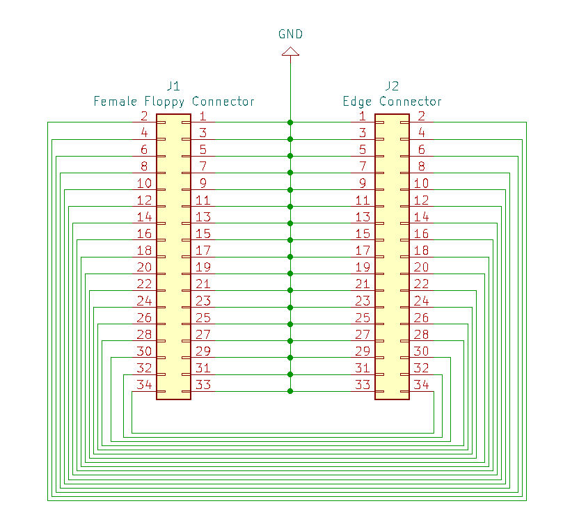
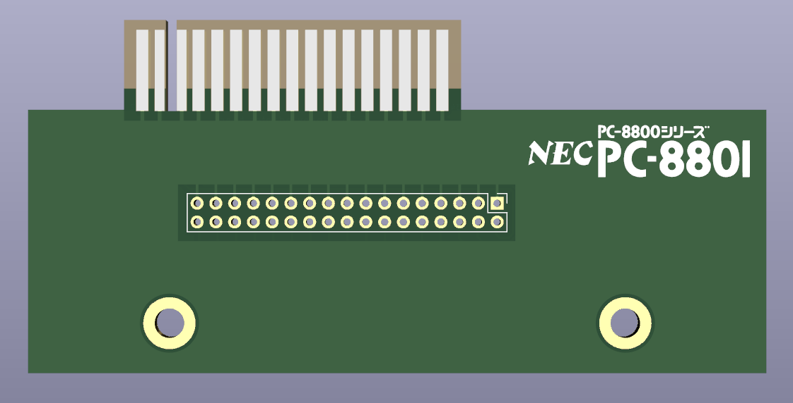
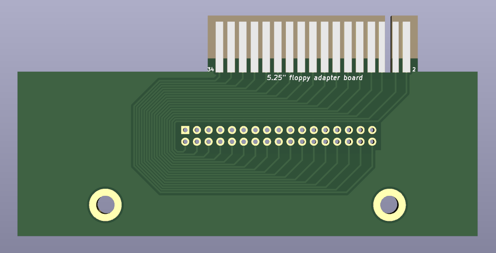
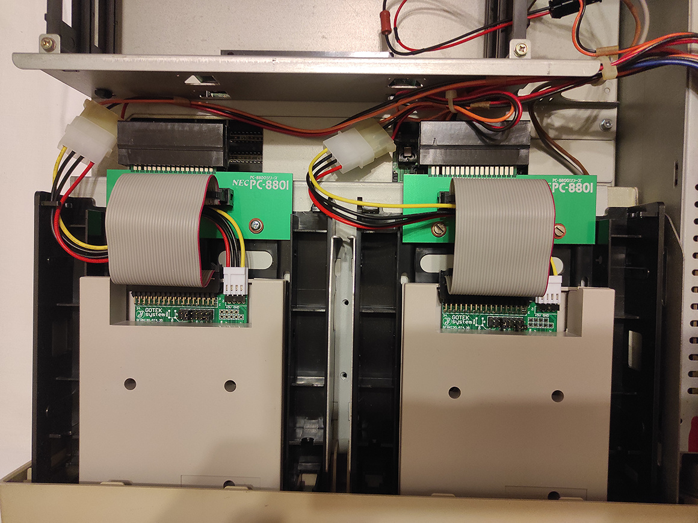
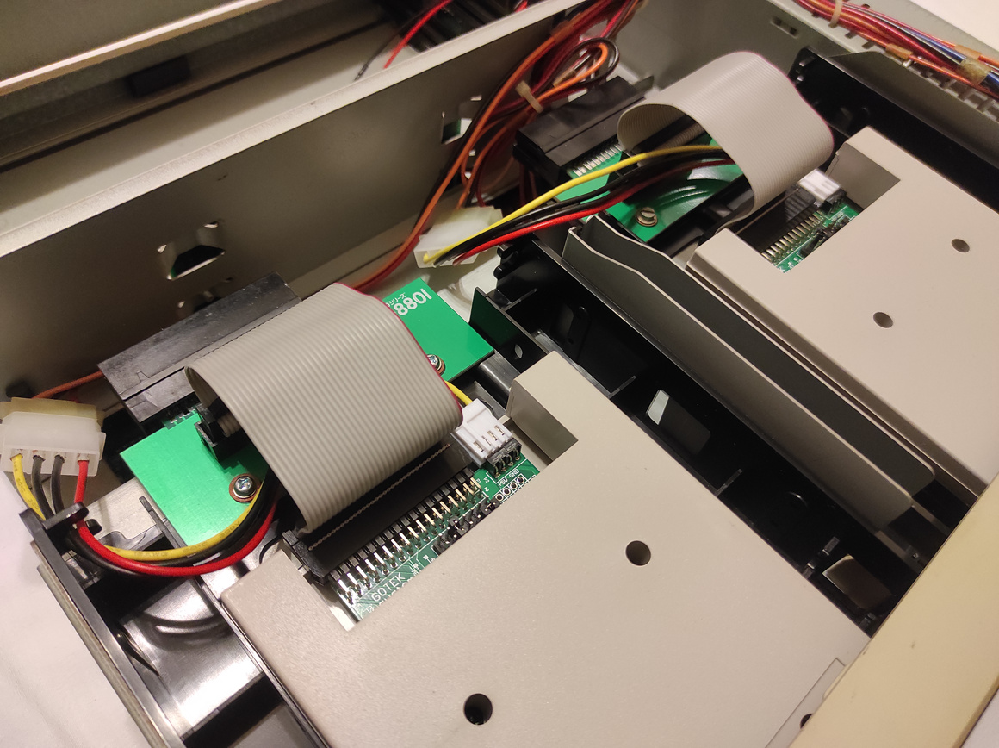
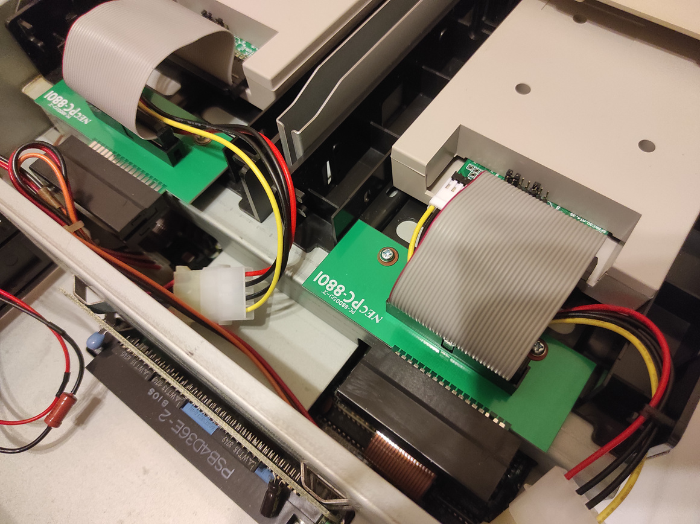

5.25" floppy connector to 3.5" adapter for NEC PC-8801 FA

**Warning: prototype PCB currenly in fabrication and not confirmed working. To be updated.**

Based on [Leaded Solder's](https://www.leadedsolder.com/) [5.25" Floppy edge connector to 34-pin 3.5" floppy drive adapter](https://www.pcbway.com/project/shareproject/5_25__Floppy_edge_connector_to_34_pin_3_5__floppy_drive_adapter.html)

Changes:
* Connector wiring flip upside down
* Enlarged PCB with mounting holes for Espada EHD-BR355SS adapter

Intended to use with:
* Espada EHD-BR355SS 3.5" to 5.25" multi-functional bracket to 5.25" PC drive bay
* GOTEK floppy drive emulator
* 2.54mm pitch 10cm Flat Ribbon Cable FC-34P (2x17 34Pin)

Schematics: 

Board view: 

Assembled boards:

